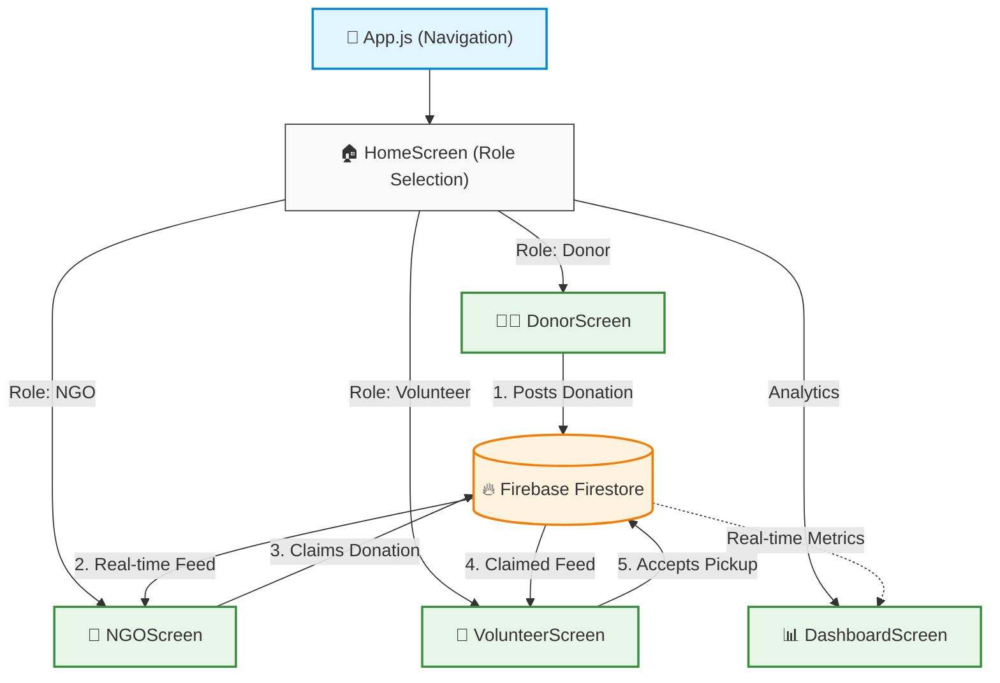

# 🌉 HungerBridge

## Project Title and Description

**HungerBridge** is a real-time, hackathon-winning mobile application dedicated to eradicating food waste by seamlessly connecting excess food resources with those who need it most. Restaurants, households, and event organizers can post their surplus food, which is instantly visible to NGOs and community workers in real-time. Through an intuitive coordination system, NGOs can claim food listings, and dedicated volunteers are assigned to bridge the gap and complete the delivery.

## Problem Statement

Every day, tons of edible food from restaurants, events, and households are thrown away, while nearby individuals struggle with severe food insecurity. This tragic paradox exists primarily because of the lack of a fast, reliable, and real-time coordination platform to bridge the gap between people with surplus food and the organizations ready to distribute it.

## Features and Functionality

- **Real-Time Donations Feed**: NGOs see an automatically updating feed of available surplus food as soon as a donor posts it.
- **Urgency & Countdown Timers**: Each donation auto-expires within 2 hours. Color-coded countdown timers highlight urgent (less than 30 mins) donations to ensure maximum food safety and freshness. NGOs have a limited time window to claim these items.
- **Instant Claim System**: NGOs can claim available food in one tap, instantly updating the database to prevent duplicate claims.
- **Volunteer Assignment**: A dedicated interface for volunteers to view claimed items and accept pickup and delivery assignments. Volunteers have a 20-minute window to accept a pickup after an NGO claims it.
- **Live Impact Dashboard**: A real-time analytics dashboard tracking total donations, claimed and available statuses.
- **Role-Based Navigation**: Quick entry points and seamless navigation across Donor, NGO, and Volunteer workflows using React Navigation.
- **Secure Firebase Integration**: Firebase credentials are secure and configured dynamically using environment variables (`.env`).

## Tech Stack Used

- **Frontend/Mobile**: React Native, Expo Go
- **Backend/Database**: Firebase Cloud Firestore (NoSQL, Real-time Listeners)
- **Navigation**: React Navigation (Native Stack)

## Project Structure

### Architecture Flow



### Directory Tree

```text
HungerBridge/
├── App.js                   # Main application entry point and navigation setup
├── app.json                 # Expo configuration
├── package.json             # Project dependencies
├── .env                     # Firebase environment variables (local)
└── src/
    ├── screens/             # UI Views for different user roles
    │   ├── HomeScreen.js    # Role selection hub
    │   ├── DonorScreen.js   # Food donation interface
    │   ├── NGOScreen.js     # NGO feed to claim donations
    │   ├── VolunteerScreen.js # Interface for volunteers to accept tasks
    │   └── DashboardScreen.js # Real-time analytics dashboard
    └── services/
        └── firebase.js      # Firebase initialization and database operations
```

## Setup/Installation Instructions

### Prerequisites

- [Node.js](https://nodejs.org/) installed
- Expo Go app installed on your physical mobile device
- Git installed on your machine
- A Firebase account (for creating your own Firestore database)

### 1. Clone the Repository

```bash
git clone https://github.com/Yash-Anokar/HungerBridge.git
cd HungerBridge
```

### 2. Install Dependencies

```bash
npm install
```

### 3. Environment Setup

Create a `.env` file in the root directory and add your Firebase credentials:

```env
EXPO_PUBLIC_FIREBASE_API_KEY=your_api_key
EXPO_PUBLIC_FIREBASE_AUTH_DOMAIN=your_auth_domain
EXPO_PUBLIC_FIREBASE_PROJECT_ID=your_project_id
EXPO_PUBLIC_FIREBASE_STORAGE_BUCKET=your_storage_bucket
EXPO_PUBLIC_FIREBASE_MESSAGING_SENDER_ID=your_messaging_sender_id
EXPO_PUBLIC_FIREBASE_APP_ID=your_app_id
EXPO_PUBLIC_FIREBASE_MEASUREMENT_ID=your_measurement_id
```

### 4. Run the App

> [!TIP]
> **Recommended for Speed & Reliability:** If your PC and mobile device are connected to the **same Wi-Fi network**, it is highly recommended to run the app over LAN for a much faster experience without relying on external tunnels.

**Option A: Run over LAN (Same Wi-Fi Network)**

```bash
npx expo start --lan
```

**Option B: Run using Tunnel (Different Networks)**
If your PC and mobile device are on different networks, you must use a tunnel. First, install the Expo ngrok package globally, then start the server:

```bash
npm install -g @expo/ngrok
npx expo start --tunnel
```

### 5. Open the App

- When the QR code generates in the terminal, open the **Expo Go** app on your phone.
- **Android**: Tap "Scan QR code" in the app and scan it.
- **iOS**: Open the native Camera app, point it at the QR code, and click the link to open Expo Go.

## Future Scope

- **Push Notifications**: Instant mobile notifications to nearby NGOs and volunteers when a new donation is posted or claimed.
- **Map & Location Integration**: Interactive maps indicating pickup radiuses, precise live tracking for volunteers, and distance sorting.
- **AI Priority Tagging**: Machine learning-based smart tagging that flags highly perishable food and re-routes it automatically to the nearest responding NGO.
- **Gamification & Leaderboards**: Give badges and points to top donors and volunteers to gamify the charitable experience and encourage repeat donations.
